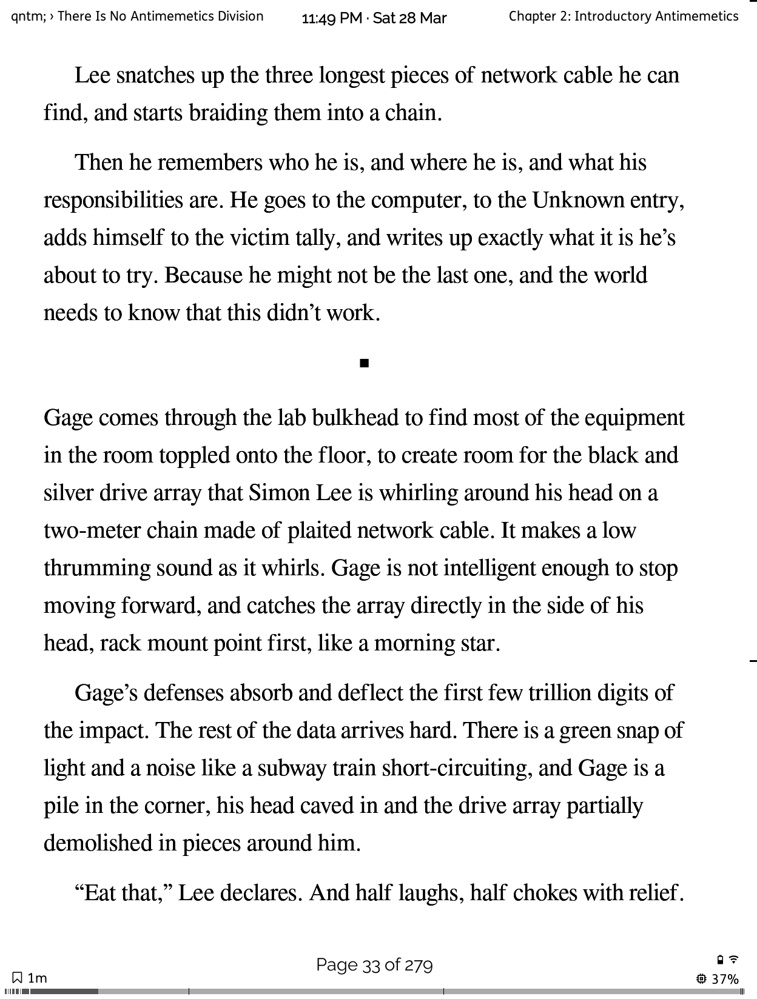
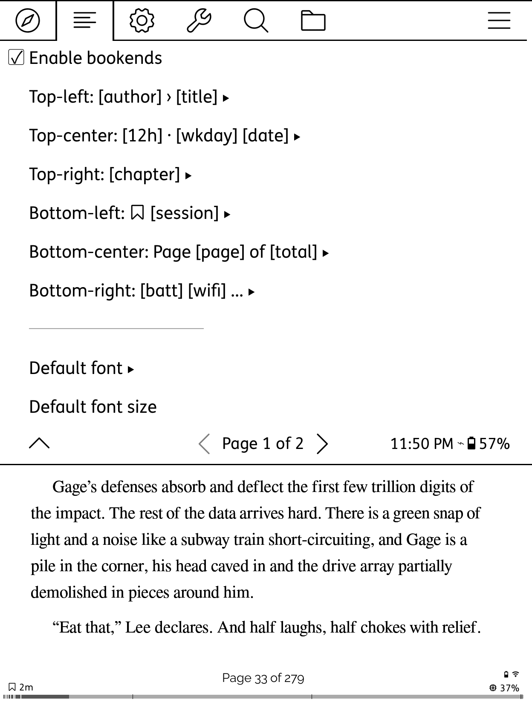
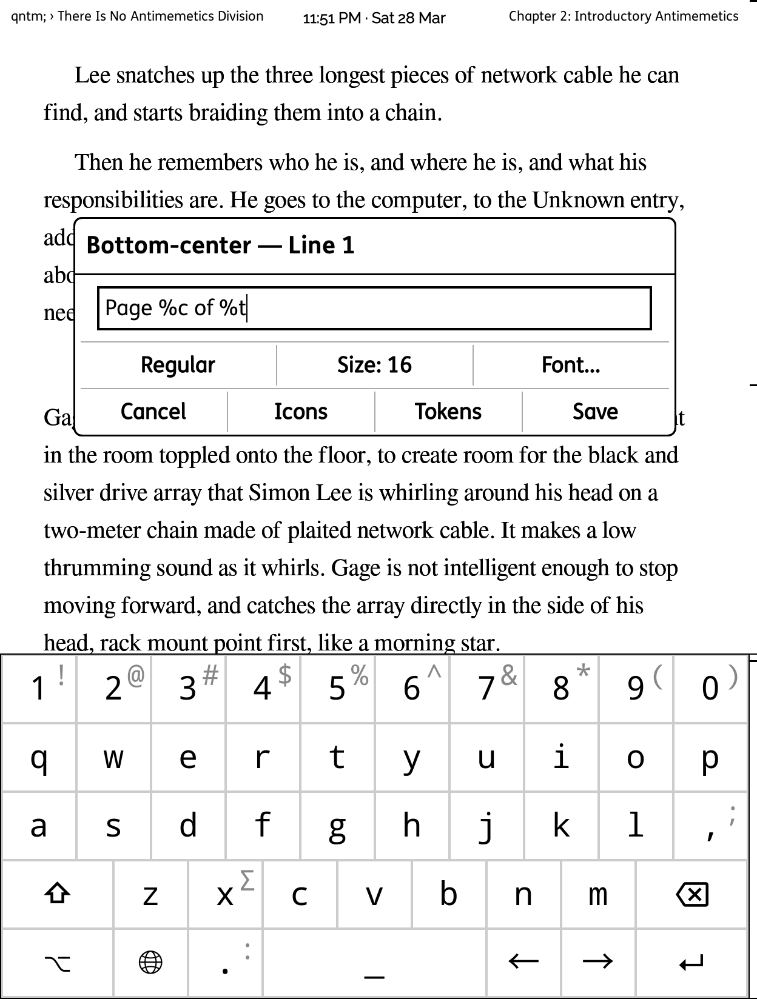
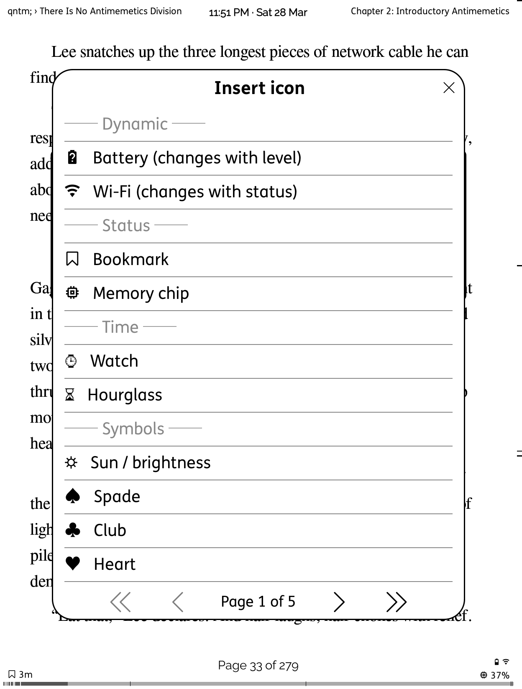
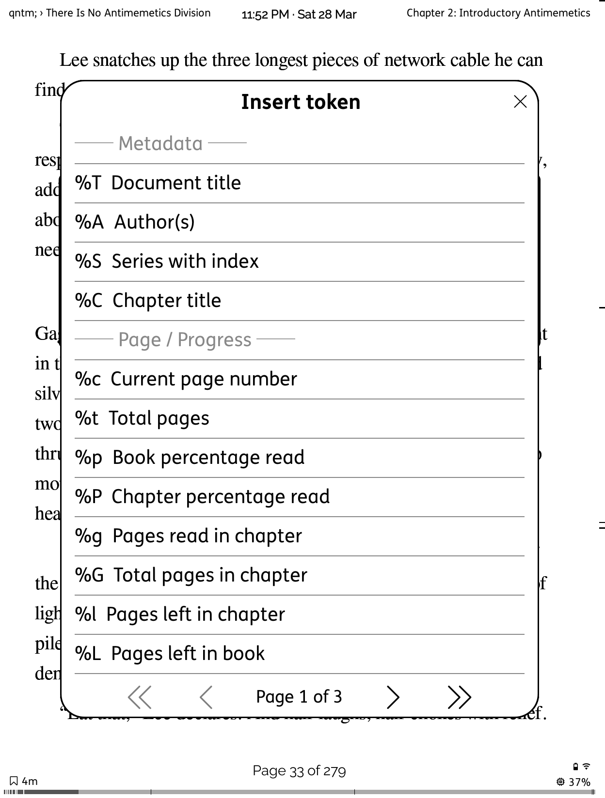

# KOReader Mods

A collection of patches and plugins for [KOReader](https://github.com/koreader/koreader).

## Patches

User patches go in the KOReader `patches/` directory. Copy the `.lua` file and restart KOReader.

| Patch | Description |
|-------|-------------|
| [2-suppress-opening-dialog.lua](patches/2-suppress-opening-dialog.lua) | Hides the "Opening file '...'" dialog that briefly flashes when opening a book. It has a zero timeout and disappears too fast to read — just visual noise. |
| [2-coverbrowser-swipe-updown.lua](patches/2-coverbrowser-swipe-updown.lua) | Adds up/down swipe for page navigation in CoverBrowser History/Collections views. Swipe up = next page, swipe down = previous page. |

## Plugins

Plugins go in the KOReader `plugins/` directory. Copy the entire `.koplugin` folder and restart KOReader.

| Plugin | Description |
|--------|-------------|
| [bookends.koplugin](plugins/bookends.koplugin) | Configurable text overlays at 6 screen positions with tokens, icons, per-line styling, and presets. See [full documentation](#bookends) below. |
| [displaymodehomefolder.koplugin](plugins/displaymodehomefolder.koplugin) | Use a different display mode and sort order in subfolders compared to the home folder. Integrates into CoverBrowser's Display Mode menu. ([FR #15198](https://github.com/koreader/koreader/issues/15198)) |

## Style Tweaks

CSS style tweaks go in the KOReader `styletweaks/` directory. Each `.css` file is automatically loaded and applied to documents. Create the directory if it doesn't exist.

| Tweak | Description |
|-------|-------------|
| [captions.css](styletweaks/captions.css) | Caption styling |
| [footnotes.css](styletweaks/footnotes.css) | Footnote formatting |
| [headings.css](styletweaks/headings.css) | Heading styles |
| [hr.css](styletweaks/hr.css) | Horizontal rule styling |
| [img.css](styletweaks/img.css) | Centre images, constrain to page width |
| [paragraphs.css](styletweaks/paragraphs.css) | Paragraph spacing and indentation |
| [tables.css](styletweaks/tables.css) | Table formatting |
| [toc.css](styletweaks/toc.css) | Table of contents styling |

---

## Bookends

A KOReader plugin for placing configurable text overlays at the corners and edges of the reading screen. Each position supports multiple lines with independent font, size, and style settings. Format strings use tokens that expand to live book metadata, reading progress, time, and device status.

### Screen positions

```
 TL              TC              TR
 ┌──────────────────────────────────┐
 │                                  │
 │          (reading area)          │
 │                                  │
 └──────────────────────────────────┘
 BL              BC              BR
```

Six positions: **Top-left**, **Top-center**, **Top-right**, **Bottom-left**, **Bottom-center**, **Bottom-right**. Each position can have multiple lines of text.

### Screenshots

| Reading page | Menu with previews |
|:---:|:---:|
|  |  |

| Line editor | Icon picker | Token picker |
|:---:|:---:|:---:|
|  |  |  |

### Quick start

1. Copy `plugins/bookends.koplugin/` to your KOReader plugins directory
2. Open a book
3. Go to the **typeset/document menu** (style icon) and find **Bookends**
4. Enable bookends
5. Tap a position (e.g., Bottom-center)
6. Tap **Add line**
7. Type a format string like `%c / %t` or use the **Tokens** and **Icons** buttons to insert
8. Tap **Save**

### Tokens

Tokens are placeholders that expand to live values. Insert them by typing `%` followed by a letter, or use the **Tokens** button in the line editor.

#### Metadata

| Token | Description | Example |
|-------|-------------|---------|
| `%T` | Document title | *The Great Gatsby* |
| `%A` | Author(s) | *F. Scott Fitzgerald* |
| `%S` | Series with index | *Dune #1* |
| `%C` | Chapter/section title | *Chapter 3: The Valley* |

#### Page / Progress

| Token | Description | Example |
|-------|-------------|---------|
| `%c` | Current page number | *42* |
| `%t` | Total pages | *218* |
| `%p` | Book percentage read | *19%* |
| `%P` | Chapter percentage read | *65%* |
| `%g` | Pages read in chapter | *7* |
| `%G` | Total pages in chapter | *12* |
| `%l` | Pages left in chapter | *5* |
| `%L` | Pages left in book | *176* |

#### Time / Date

| Token | Description | Example |
|-------|-------------|---------|
| `%k` | 12-hour clock | *2:35 PM* |
| `%K` | 24-hour clock | *14:35* |
| `%d` | Date short | *28 Mar* |
| `%D` | Date long | *28 March 2026* |
| `%n` | Date numeric | *28/03/2026* |
| `%w` | Weekday | *Friday* |
| `%a` | Weekday short | *Fri* |

#### Reading

| Token | Description | Example |
|-------|-------------|---------|
| `%h` | Time left in chapter | *0h 12m* |
| `%H` | Time left in book | *3h 45m* |
| `%R` | Session reading time | *0h 23m* |
| `%s` | Session pages read | *14* |

#### Device

| Token | Description | Example |
|-------|-------------|---------|
| `%b` | Battery level | *73%* |
| `%B` | Battery icon (dynamic) | Changes with charge level |
| `%W` | Wi-Fi icon (dynamic) | Changes with connection status |
| `%m` | RAM usage | *33%* |

Page tokens respect **stable page numbers** and **hidden flows** (non-linear EPUB content). Time-left tokens use the **statistics plugin** reading speed data. Session pages tracks forward progress only (going back doesn't inflate the count).

### Icons

The **Icons** button in the line editor opens a picker with categorised glyphs from the Nerd Fonts set (bundled with KOReader). Icons are inserted as literal Unicode characters. Categories include:

- **Dynamic** -- Battery and Wi-Fi icons that change with device state (inserts `%B` / `%W` tokens)
- **Status** -- Bookmark, memory chip
- **Time** -- Watch, hourglass
- **Symbols** -- Sun, card suits (spade/club/heart/diamond), stars
- **Arrows** -- Directional arrows, triangles, angle brackets
- **Separators** -- Vertical bar, bullets, dots, ellipsis, dashes, slashes
- **Misc** -- Check/cross marks, infinity, section signs, daggers, copyright

### Per-line styling

Each line has its own style controls in the editor dialog:

- **Style** -- Cycles through: Regular, Bold, Italic, Bold Italic
- **Size** -- Font size in pixels (defaults to global setting)
- **Font** -- Choose from the full CRE font list (checkmark shows current selection)

Italic uses NotoSans-Italic / NotoSerif-Italic font variants. Font and size default to the global settings if not overridden per-line.

### Managing lines

- Tap a **line entry** in a position's submenu to edit it
- Tap **Add line** to add a new line to the position
- **Long-press** a line entry for options: **Move up**, **Move down**, or **Delete**
- Saving an empty line automatically removes it

### Smart ellipsis

When text would overlap between positions on the same row (top or bottom), Bookends automatically truncates with ellipsis. **Center positions always get priority** -- left and right text is truncated first. A configurable minimum gap prevents text from butting up against each other.

### Presets

Save and load complete configurations:

1. Set up all your positions, lines, fonts, and offsets
2. Go to **Bookends > Presets > Create new preset from current settings**
3. Name it (e.g., "Minimal", "Full status", "Reading session")
4. To load: tap the preset name
5. To manage: long-press a preset for Update, Delete, or Rename

Presets store everything: enabled state, all positions with lines/styles/fonts, all default settings.

### Global settings

At the bottom of the Bookends menu:

| Setting | Default | Description |
|---------|---------|-------------|
| Default font | Status bar font | Base font for all overlays |
| Default font size | Status bar size | Base size for all overlays |
| Default vertical offset | 35px | Distance from screen edge (all positions) |
| Default horizontal offset | 10px | Distance from screen edge (corners only) |
| Overlap gap | 10px | Minimum space between adjacent texts |

### Example configurations

**Minimal page counter** (bottom-center):
```
Line 1: %c / %t
```

**Book info header** (top-center, two lines):
```
Line 1: %A          (Bold)
Line 2: %T          (Italic, smaller font)
```

**Reading session** (bottom-left):
```
Line 1: %s pages in %R
```

**Status corner** (top-right):
```
Line 1: %B %b  %k
```

**Chapter progress** (bottom-right):
```
Line 1: %C
Line 2: %g / %G (%P)
```

---

## Installation paths

| Device | Patches | Plugins | Style Tweaks |
|--------|---------|---------|--------------|
| Kindle | `/mnt/us/koreader/patches/` | `/mnt/us/koreader/plugins/` | `/mnt/us/koreader/styletweaks/` |
| Kobo | `/mnt/onboard/.adds/koreader/patches/` | `/mnt/onboard/.adds/koreader/plugins/` | `/mnt/onboard/.adds/koreader/styletweaks/` |
| Android | Varies -- find your KOReader install directory | Same | Same |

Create the `patches/` directory if it doesn't already exist.

## Compatibility

Tested on KOReader 2025.08 (Kindle PW5). Should work on any KOReader device.

## License

MIT
